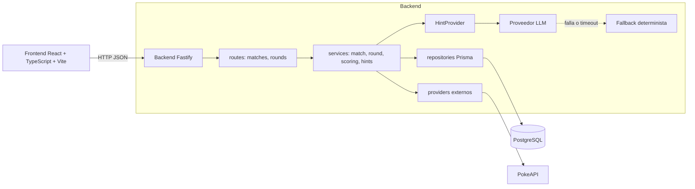

# Arquitectura - Adivina Personaje

Este documento describe la arquitectura del sistema y sus responsabilidades.

## Estilo arquitectonico

Monolito modular. Un unico backend Node.js/TypeScript con capas separadas por
responsabilidad, sin microservicios: el equipo es de una persona y el dominio
es pequeno, por lo que separar por red anadiria complejidad sin beneficio real.

## Diagrama de componentes

```text
                    ┌──────────────────────────┐
                    │      Frontend            │
                    │ React + TypeScript + Vite│
                    └─────────┬────────────────┘
                              │
                         HTTP / REST
                              │
                    ┌─────────▼────────────┐
                    │      Backend         │
                    │  Fastify (monolito)  │
                    ├──────────────────────┤
                    │ Player               │
                    │ Match                │
                    │ Round                │
                    │ EntityCache          │
                    │ Scoring              │
                    │ Hint LLM             │
                    │ Hint fallback        │
                    │ Difficulty           │
                    │ Ranking              │
                    └─────┬────────┬───────┘
                          │        │
                ┌─────────▼───┐ ┌──▼──────────────┐
                │ PostgreSQL  │ │  AI Provider    │
                │             │ │                 │
                └─────────────┘ └─────────────────┘
                          │
                    ┌─────▼──────┐
                    │  PokeAPI   │
                    └────────────┘
```

Version equivalente en Mermaid, util para exportar o versionar el diagrama:



## Capas del backend

- `routes/*.routes.ts`: define endpoints Fastify, valida entrada con Zod via
  `validateRequest` y delega en los servicios. No contiene reglas de negocio.
- `*/*.service.ts`: logica de negocio y orquestacion. Es la unica capa que
  decide resultados, puntaje, estados y transiciones.
- `*/*.repository.ts`: acceso a datos con Prisma Client. Sin logica de negocio.
- `players/`: repositorio de jugadores; crea o reutiliza un `Player` por
  `normalizedAlias` (evita duplicados por mayusculas/espacios).
- `difficulty/`: calcula el siguiente nivel desde las tres rondas resueltas
  mas recientes y define los rangos de seleccion por dificultad.
- `entities/`: repositorio de `EntityCache`; busca cache vigente por TTL y
  guarda los atributos normalizados obtenidos de PokeAPI.
- `providers/`: integraciones externas (PokeAPI). Encapsuladas detras de una
  interfaz (`CharacterProvider`) para poder sustituirlas sin tocar el dominio.
- `hints/`: contrato `HintProvider` y su implementacion `FallbackHintProvider`,
  deterministica y sin red, integrada con el proveedor de inteligencia
  artificial mediante el mismo contrato.
- `errors/`: `AppError` tipado y un manejador central Fastify que traduce
  errores de dominio, Zod y errores nativos de Fastify a un contrato JSON
  unico.
- `config/env.ts`: validacion de variables de entorno con Zod. Falla temprano
  si falta `DATABASE_URL` o `FRONTEND_ORIGIN`.
- `database/prisma.ts`: instancia unica de Prisma Client compartida por toda
  la aplicacion.

## Separacion de responsabilidades

Las dependencias solo fluyen en una direccion: `routes -> services ->
repositories/providers`. Una capa nunca llama hacia atras ni se salta un
nivel.

```text
┌──────────────┐   valida HTTP (Zod)      ┌──────────────┐
│   routes     │ ───────────────────────▶│   services   │
│ *.routes.ts  │                          │ *.service.ts │
└──────────────┘                          └───────┬──────┘
       ▲                                          │
       │ nunca accede a Prisma                    │ reglas de negocio,
       │ ni a providers directamente              │ puntaje, estados,
       │                                          │ transacciones
       │                                          ▼
       │                         ┌──────────────────────────────┐
       │                         │  repositories / providers    │
       │                         │ *.repository.ts, providers/  │
       │                         └───────────┬──────────┬───────┘
       │                                     │          │
       │                                     ▼          ▼
       │                              ┌────────────┐ ┌──────────┐
       └───────────── responde JSON ──│ PostgreSQL │ │ PokeAPI  │
                                      └────────────┘ └──────────┘
```

Reglas concretas que se cumplen hoy en el codigo:

- `routes/*.routes.ts` solo conoce Fastify, Zod (`validateRequest`) y llama a
  una funcion de `*.service.ts`. No importa `prisma` ni `fetch`.
- `*/*.service.ts` es el unico lugar que decide resultados: puntaje
  (`scoring.service.ts`), normalizacion de alias/guess, reglas de estado de
  `Match`/`Round` y las transacciones Prisma. No conoce Fastify ni `reply`.
- `*/*.repository.ts` solo hace consultas/escrituras Prisma. No contiene
  condicionales de negocio (por ejemplo, no decide si una ronda esta
  vencida).
- `providers/*` (PokeAPI) y `hints/*` (fallback/LLM) quedan detras de una
  interfaz (`CharacterProvider`, `HintProvider`) para que el dominio no sepa
  si los datos vienen de PokeAPI o de otra fuente.
- `errors/app-error.ts` y `errors/error-handler.ts` son la unica capa que
  traduce errores de negocio a respuestas HTTP; los servicios lanzan
  `AppError`, nunca construyen la respuesta ellos mismos.

Esta separacion es la que se muestra y explica en la sustentacion cuando se
pregunta "por que un monolito modular en vez de microservicios": los limites
logicos ya existen y serian el punto de corte si el proyecto creciera.


El cliente nunca envia puntaje, tiempo transcurrido, resultado de una ronda o
racha. El backend siempre calcula estos valores a partir de:

- `Round.startedAt` y el reloj del servidor, para el tiempo transcurrido.
- El nombre real de la entidad (`Round.entityName`), nunca expuesto antes de
  resolver la ronda.
- `Match.currentStreak` y `Match.totalScore`, actualizados solo dentro de
  transacciones Prisma.

## Persistencia

PostgreSQL gestionado con Docker Compose en desarrollo. El esquema se
versiona con migraciones Prisma. Entidades principales:

- `Player`: alias visible y `normalizedAlias` unico para evitar duplicados
  por mayusculas o espacios.
- `Match`: estado, modo de partida, dificultad, racha y puntaje total.
- `Round`: ronda de una partida, entidad oculta, estado, pistas usadas y
  resultado.
- `EntityCache`: cache de atributos de PokeAPI con expiracion (TTL 24h), para
  reducir llamadas externas y servir de fuente de datos a las pistas.

Restricciones relevantes a nivel de base de datos:

- Indice unico parcial: una partida no puede tener mas de una ronda `ACTIVE`
  a la vez.
- Clave foranea `Round.entityId -> EntityCache.entityId`.
- Indice unico `Round(matchId, roundNumber)`.

## Concurrencia e idempotencia

Las operaciones que cambian estado (resolver una conjetura, finalizar una
partida) se ejecutan dentro de transacciones Prisma con aislamiento
`Serializable` y actualizaciones condicionadas por estado (`updateMany` con
filtro de estado esperado). Esto evita:

- Puntuar dos veces la misma ronda ante solicitudes concurrentes.
- Sobrescribir el resultado de una partida ya finalizada.

## Seguridad

- Secretos (`DATABASE_URL`, `AI_API_KEY`) solo en archivos `.env` locales,
  ignorados por Git; `.env.example` documenta las variables sin valores
  reales.
- El backend nunca expone el nombre real de una entidad antes de resolver la
  ronda; la imagen se sirve mediante un proxy propio y se obfusca con Sharp
  mientras la ronda esta activa (`GET /rounds/:roundId/image`), para no filtrar
  el identificador externo ni el artwork original de PokeAPI.
- Los errores devueltos al cliente siguen un contrato fijo
  (`statusCode`, `code`, `message`) sin stack traces ni detalles internos.

## Resiliencia ante servicios externos

- Llamadas a PokeAPI con timeout de 3 segundos; los fallos se traducen a
  `502 / UPSTREAM_UNAVAILABLE`.
- Cache de entidades para reducir dependencia de PokeAPI en solicitudes
  repetidas.
- Generador de pistas por fallback determinista, sin red ni dependencia
  externa, que mantiene disponible el juego cuando el proveedor de
  inteligencia artificial no responde.
