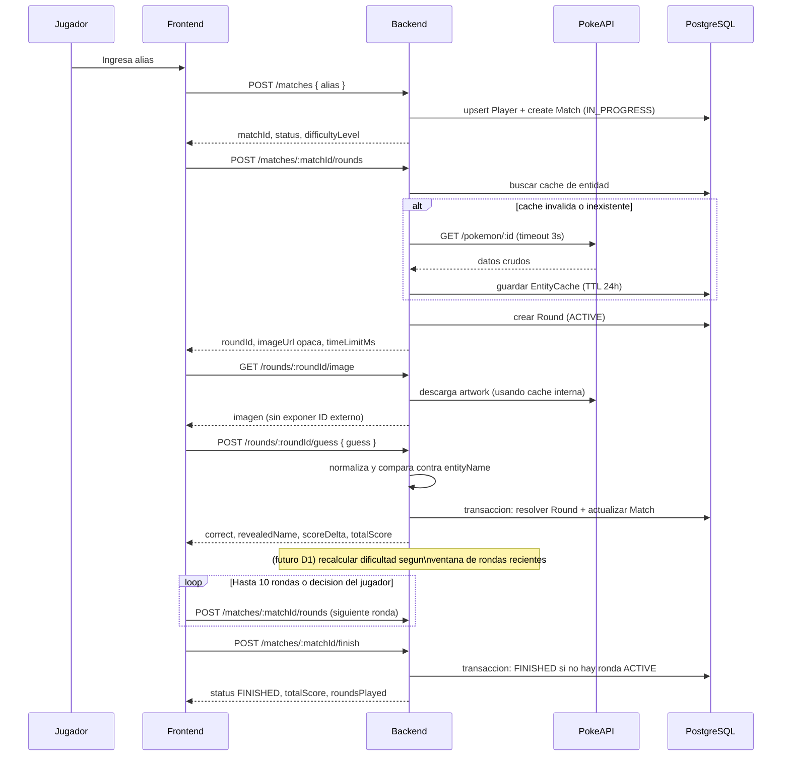
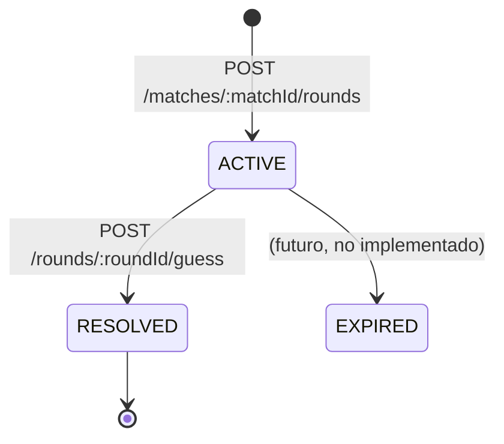
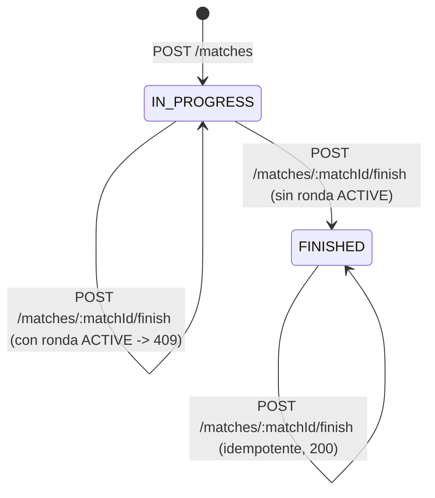
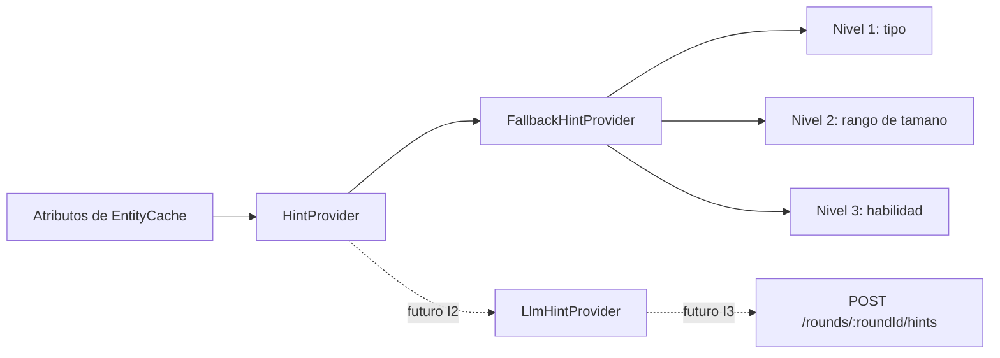

# Flujo del juego - Adivina Personaje

Estado: describe el flujo backend implementado hasta G4 e I1. Las pistas via
LLM (I2), el endpoint de pistas (I3), la dificultad adaptativa (D1) y la
interfaz de usuario (U1-U3) todavia no existen; se documentan como pasos
futuros marcados explicitamente.

Este documento se actualiza a medida que avanzan las historias de usuario.
Cada vez que se cierre una HU que cambie el flujo (I3, D1, U1-U3), se debe
revisar y ajustar los diagramas de esta pagina.

## Flujo end-to-end de una partida

```text
┌───────────────┐        ┌───────────────────────────┐
│   Jugador     │        │ 1. Crear partida          │
│  ingresa alias│───────▶│ POST /matches              │
└───────────────┘        │ Player upsert + Match      │
                          │ (IN_PROGRESS, EASY)        │
                          └─────────────┬───────────────┘
                                        │
                                        ▼
                          ┌───────────────────────────┐
                          │ 2. Crear ronda oculta      │
                          │ POST /matches/:id/rounds   │
                          │ cache EntityCache o        │
                          │ PokeAPI (timeout 3s)       │
                          └─────────────┬───────────────┘
                                        │
                                        ▼
                          ┌───────────────────────────┐
                          │ 3. Mostrar imagen          │
                          │ GET /rounds/:id/image      │
                          │ (proxy, sin ID externo)    │
                          └─────────────┬───────────────┘
                                        │
                     ┌──────────────────┼───────────────────┐
                     ▼                                      ▼
        ┌───────────────────────────┐         ┌───────────────────────────┐
        │ 4a. Pedir pista            │         │ 4b. Responder              │
        │ (I3, pendiente)             │         │ POST /rounds/:id/guess     │
        │ Hint fallback / LLM         │         │ compara server-side        │
        └─────────────┬───────────────┘         └─────────────┬───────────────┘
                      │                                        │
                      └───────────────────┬────────────────────┘
                                          ▼
                          ┌───────────────────────────┐
                          │ 5. Resolver ronda          │
                          │ score, streak, revealName  │
                          │ transaccion Serializable   │
                          └─────────────┬───────────────┘
                                        │
                                        ▼
                          ┌───────────────────────────┐
                          │ 5b. Ajustar dificultad     │
                          │ (D1, pendiente)            │
                          │ segun ventana de rondas    │
                          │ recientes                  │
                          └─────────────┬───────────────┘
                                        │
                          ┌─────────────┴───────────────┐
                          ▼                              ▼
            ┌───────────────────────────┐  ┌───────────────────────────┐
            │ 6a. Rondas < 10            │  │ 6b. Rondas = 10 o el      │
            │ vuelve al paso 2           │  │ jugador decide terminar   │
            │ (siguiente ronda)          │  │                           │
            └───────────────────────────┘  └─────────────┬───────────────┘
                                                          ▼
                                          ┌───────────────────────────┐
                                          │ 7. Finalizar partida       │
                                          │ POST /matches/:id/finish   │
                                          │ idempotente, sin ronda     │
                                          │ ACTIVE                     │
                                          └───────────────────────────┘
```

Version equivalente en Mermaid, util para exportar o versionar el diagrama:



## Maquina de estados de una ronda



Reglas vigentes:

- Solo puede existir una ronda `ACTIVE` por partida (garantizado por indice
  unico parcial en PostgreSQL).
- Una ronda `RESOLVED` no puede volver a puntuar: una segunda conjetura
  responde `409 / CONFLICT`.
- El estado `EXPIRED` esta modelado en el enum pero aun no se activa
  automaticamente; el limite de tiempo hoy es solo visual/informativo
  (`timeLimitMs`) y se usa para el bonus de velocidad, no para expirar la
  ronda del lado del servidor.

## Maquina de estados de una partida



## Calculo de puntaje (G3)

```mermaid
flowchart TD
    A[Recibe guess] --> B{Normalizado == entityName normalizado?}
    B -- No --> C[scoreDelta = 0, streak = 0]
    B -- Si --> D[speedBonus segun tiempo transcurrido]
    D --> E[Penalizacion = 15 x hintsUsed]
    E --> F[Multiplicador = 1 + 0.1 x min(streak, 5)]
    F --> G[scoreDelta = max(0, (100 + speedBonus - penalizacion) x multiplicador)]
    C --> H[Persistir Round RESOLVED + actualizar Match]
    G --> H
```

## Generacion de pistas (estado actual: solo fallback, I1)



El fallback nunca recibe el nombre ni el ID de la entidad, por lo que no
puede revelarlos. El endpoint HTTP de pistas, el control de limite de tres
pistas y la persistencia en `Round.hints` se implementaran en `I3`.

## Que falta para completar el bucle de juego descrito en el enunciado

- `I2`: proveedor LLM intercambiable con el mismo contrato que el fallback.
- `I3`: endpoint `POST /rounds/:roundId/hints`, limite de 3 pistas,
  penalizacion por pista y persistencia en `Round.hints`.
- `D1`: dificultad adaptativa segun ventana de rondas recientes.
- `U1-U3`: interfaz de usuario que consuma este flujo (hoy solo probado via
  API).
