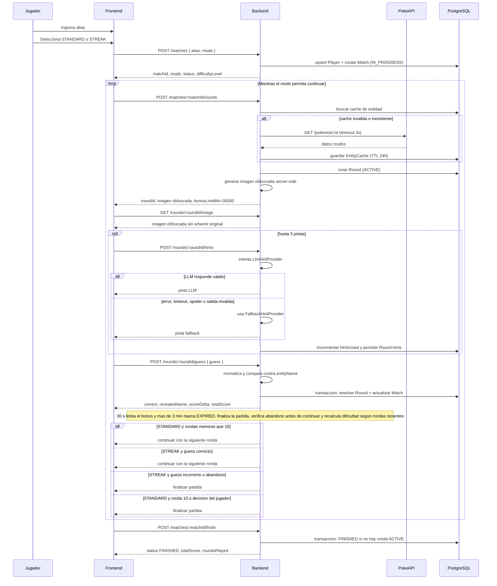
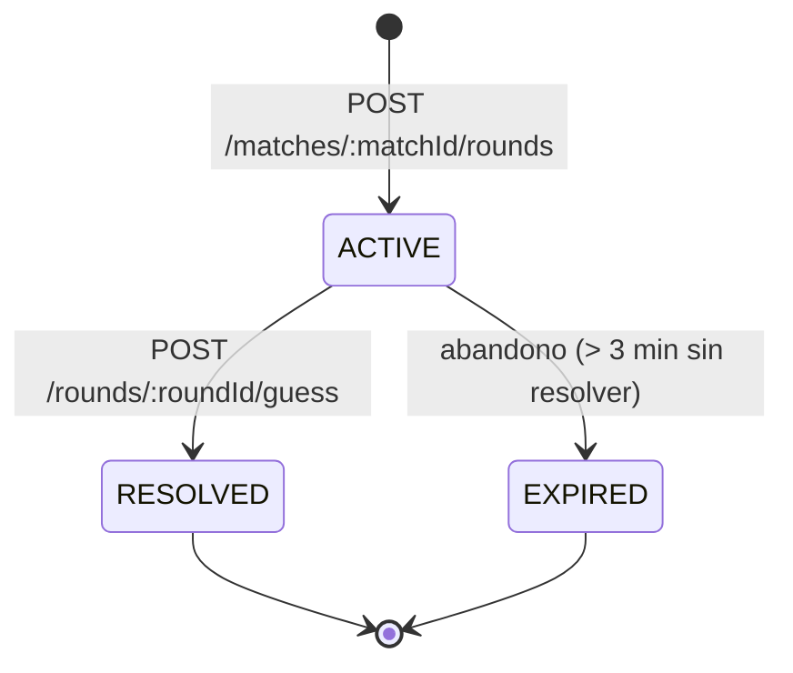
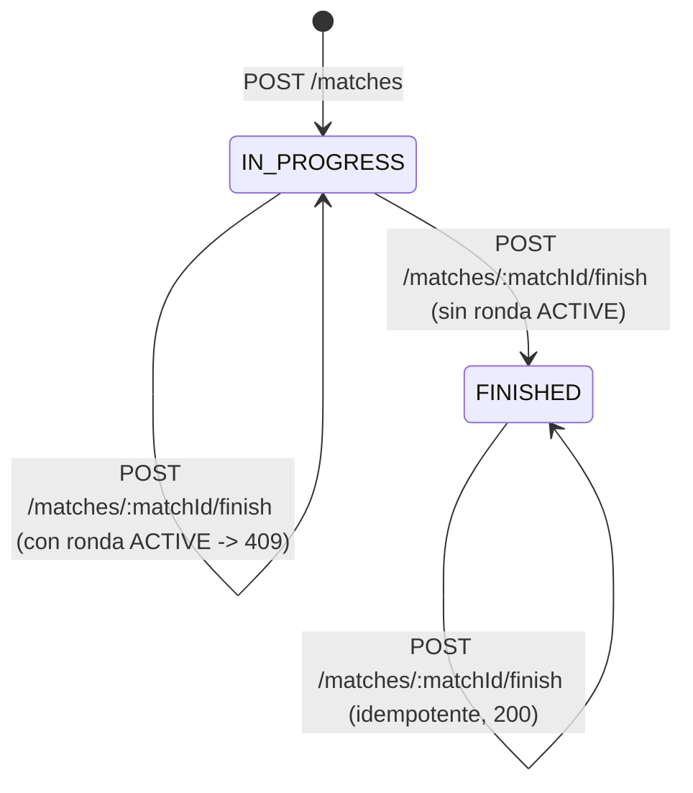
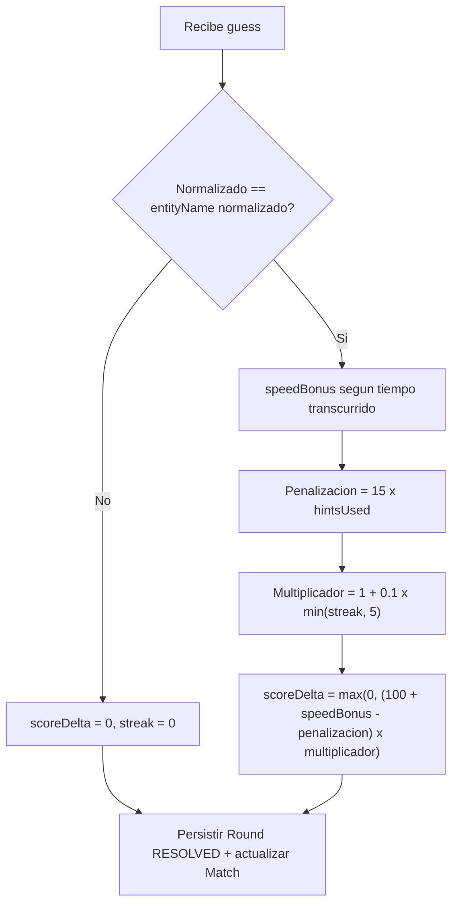
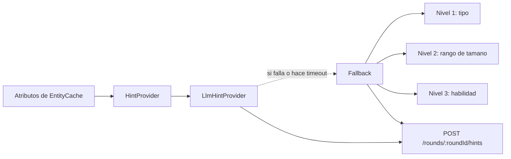

# Flujo del juego - Adivina Personaje

Este documento describe el flujo completo del juego, de inicio a fin, y se
actualiza si el diseno cambia durante el desarrollo.

## Flujo end-to-end de una partida

```text
                ┌────────────────────────────┐
                │ Crear partida              │
                │ alias + modo               │
                └──────────────┬─────────────┘
                               │
                ┌──────────────┴─────────────┐
                ▼                            ▼
        ┌────────────────────┐      ┌────────────────────┐
        │ STANDARD           │      │ STREAK             │
        │ hasta 10 rondas    │      │ hasta primer fallo │
        └─────────┬──────────┘      └─────────┬──────────┘
                  └──────────────┬────────────┘
                                 ▼
                  ┌────────────────────────────┐
                  │ Crear ronda                │
                  │ imagen obfuscada           │
                  │ desde backend              │
                  └──────────────┬─────────────┘
                                 ▼
                  ┌────────────────────────────┐
                  │ Adivinar o pedir hasta     │
                  │ 3 pistas: LLM -> fallback  │
                  └──────────────┬─────────────┘
                                 ▼
                  ┌────────────────────────────┐
                  │ Resolver ronda             │
                  │ revelar y puntuar          │
                  └──────────────┬─────────────┘
                                 ▼
                  ┌────────────────────────────┐
                  │ Ajustar dificultad y       │
                  │ persistir estado           │
                  └──────────────┬─────────────┘
                                 │
                  ┌──────────────┴─────────────┐
                  ▼                            ▼
        ┌────────────────────┐      ┌────────────────────────┐
        │ Continuar siguiente│      │ Finalizar y mostrar    │
        │ ronda según el modo│      │ puntaje y ranking      │
        └──────────┬─────────┘      └────────────────────────┘
                   │
                   └────────────── vuelve a Crear ronda

Abandono: si una ronda supera 3 minutos, se marca EXPIRED y finaliza la partida.
```

Version equivalente en Mermaid, util para exportar o versionar el diagrama:



## Maquina de estados de una ronda



Reglas vigentes:

- Solo puede existir una ronda `ACTIVE` por partida (garantizado por indice
  unico parcial en PostgreSQL).
- Una ronda `RESOLVED` no puede volver a puntuar: una segunda conjetura
  responde `409 / CONFLICT`.
- Una ronda que supera 3 minutos sin resolverse se marca `EXPIRED` con
  puntaje 0 y racha reiniciada, y la partida se finaliza en la misma
  transaccion (ver ADR-08 en `DECISIONS.md`). El limite de tiempo por
  dificultad (`timeLimitMs`) sigue siendo independiente: solo afecta el
  bonus de velocidad del puntaje.

## Maquina de estados de una partida



## Calculo de puntaje (G3)



## Generacion de pistas



Ni el fallback ni el LLM reciben el nombre ni el ID de la entidad, por lo
que no pueden revelarlos. El endpoint de pistas controla el limite de tres
por ronda y persiste cada pista generada en `Round.hints`.

## Orden de implementacion aprobado

El cierre del bucle se ejecuta en este orden para mantener las dependencias
controladas:

1. I3 implementa pistas, fallback, limite de tres, persistencia, penalizacion
    y expiracion reutilizable.
2. G2 recibe la correccion para entregar la imagen obfuscada desde backend.
3. Una HU tecnica agrega los modos `STANDARD` (10 rondas) y `STREAK` (hasta
    el primer fallo), con su migracion.
4. D1 implementa dificultad adaptativa.
5. U1 permite elegir el modo al iniciar.
6. U2 representa la ronda completa, sus dos relojes, pistas y expiracion.
7. U3 muestra resultado, puntaje persistido y ranking.
8. Q1/Q2 validan dominio, integracion y flujo completo.
9. X1 consolida ADRs, flujo, README y bitacora.

Los dos relojes son independientes: 30 segundos limitan el bonus de velocidad
y 3 minutos determinan abandono. La formula vigente de G3 se mantiene; la
alternativa de puntos base 100/50/20 no forma parte de este alcance.
