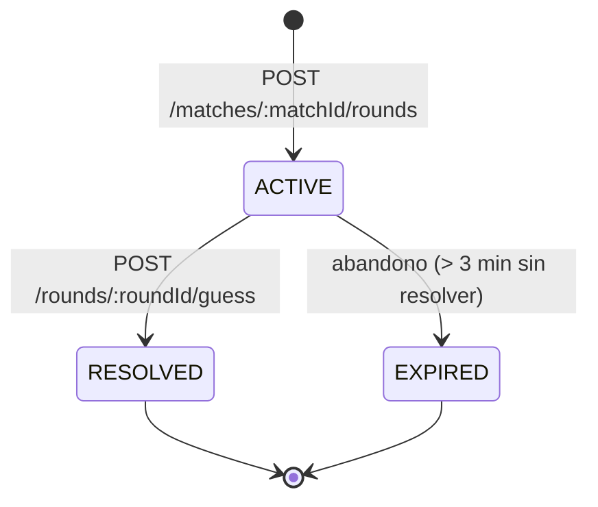
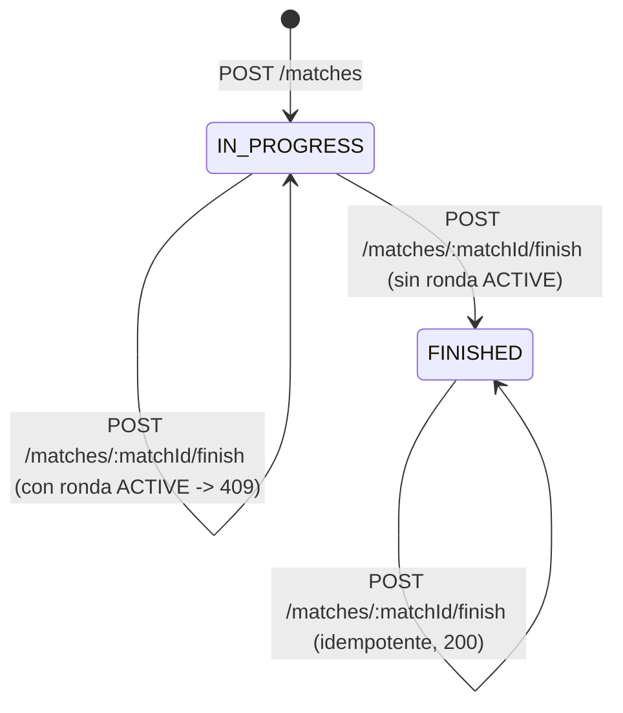
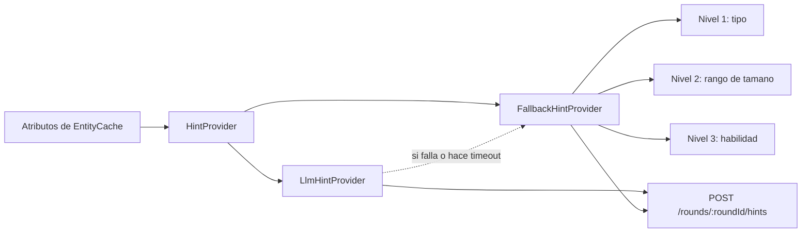

# Flujo del juego - Adivina Personaje

Este documento describe el flujo completo del juego, de inicio a fin, y se
actualiza si el diseno cambia durante el desarrollo.

## Flujo end-to-end de una partida

```text
┌───────────────┐         ┌───────────────────────────┐
│   Jugador     │         │ 1. Crear partida          │
│  ingresa alias│───────▶│ POST /matches             │
└───────────────┘         │ Player upsert + Match     │
                          │ (IN_PROGRESS, EASY)       │
                          └─────────────┬─────────────┘
                                        │
                                        ▼
                          ┌────────────────────────────┐
                          │ 2. Crear ronda oculta      │
                          │ POST /matches/:id/rounds   │
                          │ cache EntityCache o        │
                          │ PokeAPI (timeout 3s)       │
                          └─────────────┬──────────────┘
                                        │
                                        ▼
                          ┌────────────────────────────┐
                          │ 3. Mostrar imagen          │
                          │ GET /rounds/:id/image      │
                          │ (proxy, sin ID externo)    │
                          └─────────────┬──────────────┘
                                        │
                     ┌──────────────────┼───────────────────┐
                     ▼                                      ▼
        ┌───────────────────────────┐         ┌───────────────────────────┐
        │ 4a. Pedir pista           │         │ 4b. Responder             │
        │ POST /rounds/:id/hints    │         │ POST /rounds/:id/guess    │
        │ Hint fallback / LLM       │         │ compara server-side       │
        └─────────────┬─────────────┘         └────────────────┬──────────┘
                      │                                        │
                      └───────────────────┬────────────────────┘
                                          ▼
                          ┌────────────────────────────┐
                          │ 5. Resolver ronda          │
                          │ score, streak, revealName  │
                          │ transaccion Serializable   │
                          └─────────────┬──────────────┘
                                        │
                                        ▼
                          ┌────────────────────────────┐
                          │ 5b. Ajustar dificultad     │
                          │ segun ventana de rondas    │
                          │ recientes                  │
                          └─────────────┬──────────────┘
                                        │
                          ┌─────────────┴───────────────┐
                          ▼                             ▼
            ┌───────────────────────────┐  ┌───────────────────────────┐
            │ 6a. Rondas < 10           │  │ 6b. Rondas = 10 o el      │
            │ vuelve al paso 2          │  │ jugador decide terminar   │
            │ (siguiente ronda)         │  │                           │
            └───────────────────────────┘  └─────────────┬─────────────┘
                                                         ▼
                                          ┌───────────────────────────┐
                                          │ 7. Finalizar partida      │
                                          │ POST /matches/:id/finish  │
                                          │ idempotente, sin ronda    │
                                          │ ACTIVE                    │
                                          └───────────────────────────┘
```

Version equivalente en Mermaid, util para exportar o versionar el diagrama:

```mermaid
sequenceDiagram
    participant Jugador
    participant Frontend
    participant Backend
    participant PokeAPI
    participant DB as PostgreSQL

    Jugador->>Frontend: Ingresa alias
    Frontend->>Backend: POST /matches { alias }
    Backend->>DB: upsert Player + create Match (IN_PROGRESS)
    Backend-->>Frontend: matchId, status, difficultyLevel

    Frontend->>Backend: POST /matches/:matchId/rounds
    Backend->>DB: buscar cache de entidad
    alt cache invalida o inexistente
        Backend->>PokeAPI: GET /pokemon/:id (timeout 3s)
        PokeAPI-->>Backend: datos crudos
        Backend->>DB: guardar EntityCache (TTL 24h)
    end
    Backend->>DB: crear Round (ACTIVE)
    Backend-->>Frontend: roundId, imageUrl opaca, timeLimitMs

    Frontend->>Backend: GET /rounds/:roundId/image
    Backend->>PokeAPI: descarga artwork (usando cache interna)
    Backend-->>Frontend: imagen (sin exponer ID externo)

    Frontend->>Backend: POST /rounds/:roundId/guess { guess }
    Backend->>Backend: normaliza y compara contra entityName
    Backend->>DB: transaccion: resolver Round + actualizar Match
    Backend-->>Frontend: correct, revealedName, scoreDelta, totalScore

    Note over Backend: cada endpoint que toca la partida verifica primero\nsi la ronda ACTIVE supero 3 min (abandono); si es asi, la expira\ny finaliza la partida antes de continuar

    Note over Backend: recalcula dificultad segun ventana de rondas recientes

    loop Hasta 10 rondas o decision del jugador
        Frontend->>Backend: POST /matches/:matchId/rounds (siguiente ronda)
    end

    Frontend->>Backend: POST /matches/:matchId/finish
    Backend->>DB: transaccion: FINISHED si no hay ronda ACTIVE
    Backend-->>Frontend: status FINISHED, totalScore, roundsPlayed
```

## Maquina de estados de una ronda



Reglas vigentes:

- Solo puede existir una ronda `ACTIVE` por partida (garantizado por indice
  unico parcial en PostgreSQL).
- Una ronda `RESOLVED` no puede volver a puntuar: una segunda conjetura
  responde `409 / CONFLICT`.
- Una ronda que supera 3 minutos sin resolverse se marca `EXPIRED` con
  puntaje 0 y racha reiniciada, y la partida se finaliza en la misma
  transaccion (ver ADR-08 en `DECISIONS.md`). El limite de tiempo por
  dificultad (`timeLimitMs`) sigue siendo independiente: solo afecta el
  bonus de velocidad del puntaje.

## Maquina de estados de una partida



## Calculo de puntaje (G3)

```mermaid
flowchart TD
    A[Recibe guess] --> B{Normalizado == entityName normalizado?}
    B -- No --> C[scoreDelta = 0, streak = 0]
    B -- Si --> D[speedBonus segun tiempo transcurrido]
    D --> E[Penalizacion = 15 x hintsUsed]
    E --> F[Multiplicador = 1 + 0.1 x min(streak, 5)]
    F --> G[scoreDelta = max(0, (100 + speedBonus - penalizacion) x multiplicador)]
    C --> H[Persistir Round RESOLVED + actualizar Match]
    G --> H
```

## Generacion de pistas



Ni el fallback ni el LLM reciben el nombre ni el ID de la entidad, por lo
que no pueden revelarlos. El endpoint de pistas controla el limite de tres
por ronda y persiste cada pista generada en `Round.hints`.
